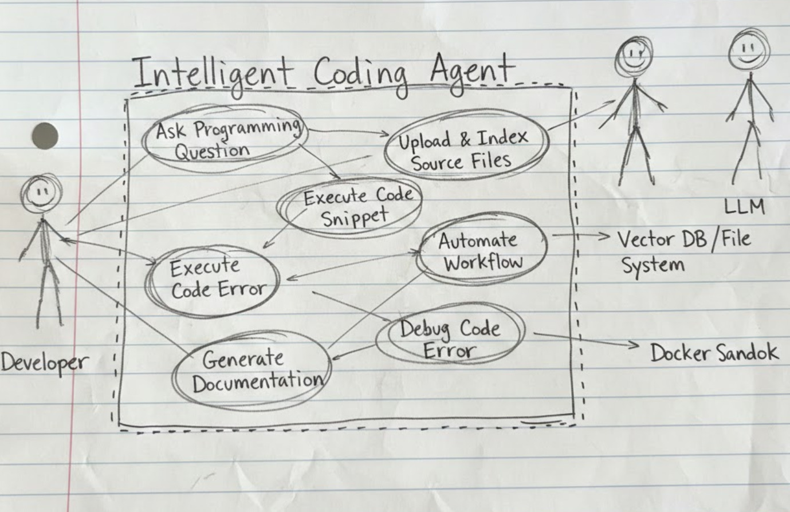

# Date: 19/1/25

## Discussed about Scope & Actors

- Finalize the list of Actors and Use Cases based on project requirements
- **Primary Actor:** The Developer/User (who asks questions and uploads files) 
- **Secondary/System Actors:** Based on "System Requirements", these could include the LLM API (OpenAI/Gemini) and other APIs and Compilers

## Making a rough UML diagram

## Work Distribution

| Team Member | Task |
|------------|------|
| Abhas | Identifying Use Cases |
| Aniruddha | Identifying Actors |
| Abhinav | Preparing the corresponding Diagram |

## Actors

- User (Developer / Student)
- Admin (System Management) 
- Auth Service
- Database
- External Backend Agent

## User (Developer / Student) Use Cases

### Account & Profile
- Login
- Register 
- Manage Profile
- Logout

### Coding & AI Assistance
- Ask Coding Question
- Refine Question
- Provide Context
- Generate Code
- Explain Code
- Debug Errors

### Code Execution
- Run / Compile Code
- Create Files

### Task Automation
- Automate Tasks
- Schedule Task
- Define Task Trigger
- View Active Tasks

### File & Repository Handling
- Upload Files
- Analyze Repository
- Import from GitHub
- Index Local Files

### History & Data
- View Chat History

## Admin (System Management) Use Cases
- Login
- Logout
- Manage Users
- View System Logs
- Configure Agent Settings

## Backend / System Use Cases

### Authentication
- Authenticate User

### Data Handling
- Store Data
- Retrieve Data

### Execution Engine
- Execute Command
- Capture Output
- Execute Backend Task

## External Systems Use Cases

### Auth Service
- Authenticate User

### Database
- Store Data
- Retrieve Data

### External Backend Agent
- Execute Backend Task

## Relationships

### 1. «include» Relationships (Mandatory)

*These are required steps. If you do A, you must do B.*

- Login «include» Authenticate User
- Register «include» Authenticate User
- Run / Compile Code «include» Execute Command
- Run / Compile Code «include» Capture Output
- Schedule Task «include» Define Task Trigger

### 2. «extend» Relationships (Optional) 

*These are optional steps. The arrow points FROM the extra step TO the main step.*
Register «include» Authenticate User

- Refine Question «extend» Ask Coding Question
- Provide Context «extend» Ask Coding Question
- Debug Errors «extend» Explain Code (You only debug if the explanation reveals errors.)
- Import from GitHub «extend» Analyze Repository
- Index Local Files «extend» Analyze Repository

i make a rough UCL diagram

