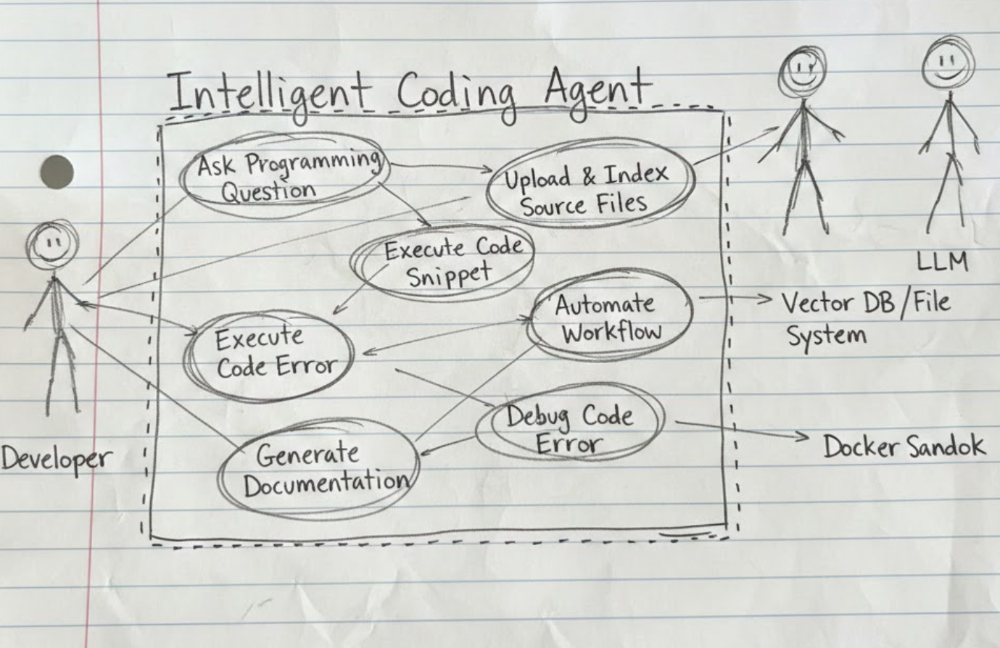
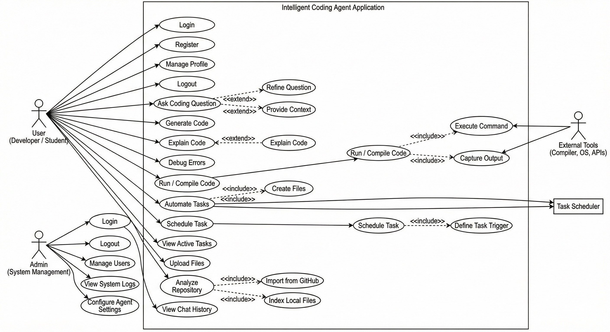
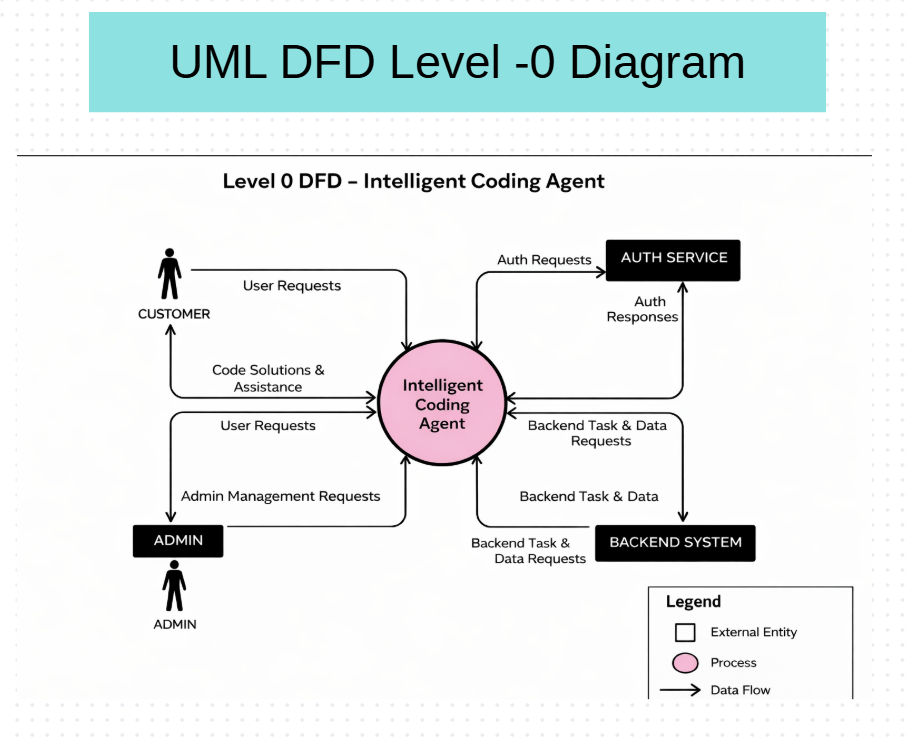

# Project Discussions

**Date:** 2025-01-19

## Summary
- Finalize scope, actors, and primary use cases for the project.
- Produce a rough UML/UCL diagram and distribute work among team members.

## Scope & Actors

- **Primary Actor:** Developer / Student — asks questions, uploads files, runs code.
- **Secondary/System Actors:** LLM API (OpenAI/Gemini), Auth service, Database, External backend agent, Execution engine.

## UML / Diagrams

Rough diagrams created during the discussion:

- 
- 

## Work Distribution

| Team Member | Task |
|------------:|------|
| Abhas      | Identify use cases |
| Aniruddha  | Identify actors |
| Abhinav    | Prepare diagrams |

## Actors

- User (Developer / Student)
- Admin (System Management)
- Auth Service
- Database
- External Backend Agent

## Use Cases

### User (Developer / Student)

#### Account & Profile
- Login
- Register
- Manage profile
- Logout

#### Coding & AI Assistance
- Ask coding question
- Refine question
- Provide context
- Generate code
- Explain code
- Debug errors

#### Code Execution
- Run / compile code
- Create files

#### Task Automation
- Automate tasks
- Schedule tasks
- Define task triggers
- View active tasks

#### File & Repository Handling
- Upload files
- Analyze repository
- Import from GitHub
- Index local files

#### History & Data
- View chat history

### Admin (System Management)
- Login / Logout
- Manage users
- View system logs
- Configure agent settings

### Backend / System

#### Authentication
- Authenticate user

#### Data Handling
- Store data
- Retrieve data

#### Execution Engine
- Execute commands
- Capture output
- Execute backend tasks

### External Systems

#### Auth Service
- Authenticate user

#### Database
- Store data
- Retrieve data

#### External Backend Agent
- Execute backend tasks

## Relationships

### Include (mandatory)

- Login «include» Authenticate User
- Register «include» Authenticate User
- Run / Compile Code «include» Execute Command
- Run / Compile Code «include» Capture Output
- Schedule Task «include» Define Task Trigger

### Extend (optional)

- Refine Question «extend» Ask Coding Question
- Provide Context «extend» Ask Coding Question
- Debug Errors «extend» Explain Code (debugging follows explanation when errors are found)
- Import from GitHub «extend» Analyze Repository
- Index Local Files «extend» Analyze Repository

## Notes

- The diagrams are draft versions; diagrams should be refined into a proper UML/UCL using a modeling tool.
- Confirm any missing actors or system integrations before finalizing the use-case model.

now i am making a separate final file for assignment 2

# Assignment 3

## UML Level 0 DFD

### Components of System Boundary

### 1. Process (The System)
There is only one process at this level, representing the entire application as a "black box."

**Intelligent Coding Agent:** 
This single circle represents your entire software. All the internal logic we saw in Level 1 (like "Process Coding Requests," "Manage Files," and the internal "Database") is hidden inside this circle. It receives inputs, processes them using its internal logic, and produces outputs.

---

### 2. External Entities (The Interactors)

These entities exist **outside the system boundary** and interact with the Intelligent Coding Agent by providing inputs or receiving outputs.

**Customer:**  
The end user of the system who submits coding-related questions, problem statements, and requests for code solutions. The Customer receives generated code, explanations, and responses from the Intelligent Coding Agent.

**Admin:**  
The system administrator who interacts with the Intelligent Coding Agent to perform administrative and management tasks such as configuring system settings, monitoring system behavior, or viewing high-level logs.

**Auth Service:**  
An external authentication and authorization service responsible for verifying user credentials. It receives authentication requests from the Intelligent Coding Agent and returns validation responses or security tokens to ensure secure access.

**Backend System:**  
An external system or service that supports the Intelligent Coding Agent by handling computationally intensive tasks, external data retrieval, or integration with third-party services. The Intelligent Coding Agent delegates such tasks to this system and receives the processed results.

---

### 3. Data Flows (High-Level Interactions)
These show the broad movement of information across the system boundary.

**User Interactions:**  
The Customer sends "User Requests" and receives "Code Solutions & Assistance".

**Admin Interactions:**  
The Admin sends "Admin Management Requests" (the response flow is implied or bundled into the system's operation here).

**Security Check:**  
The System sends "Auth Requests" and receives "Auth Responses" from the Auth Service.

**Backend Processing:**  
The System sends "Backend Task & Data Requests" and receives processed "Backend Task & Data" from the Backend System.

### UML DFD Level 0 Dig

### UML DFD LEVEL 1 DESCRIPTION

### External Entities (Detailed)

**User:**  
The end user (Developer/Student) who submits coding questions, uploads files, and requests code generation, debugging, and execution assistance.

**Admin:**  
The system administrator who manages users, configures system settings, views logs, and oversees system operations.

**Auth Service:**  
An external authentication service that verifies user credentials and manages authorization tokens for secure access.

**Database:**  
An external data storage system responsible for persisting user data, chat history, code files, and system configurations.

**External Agent / Backend:**  
An external backend system that handles computationally intensive tasks, code execution, task automation, and integration with third-party services like GitHub or LLM APIs.

---

### Processes (High-Level Operations)

**1.0 Manage User Access & Profile:**  
Handles user registration, login, profile management, and logout functionality.

**2.0 Process Coding Request:**  
Receives coding questions, refines context, generates code solutions, and provides code explanations using AI assistance.

**3.0 Execute & Automate Tasks:**  
Executes user code, compiles programs, captures output, and manages task scheduling with defined triggers.

**4.0 Manage Files & Repository:**  
Handles file uploads, repository analysis, GitHub imports, and local file indexing.

**5.0 Manage API Operations:**  
Manages interactions with external APIs, including authentication, LLM service calls, and backend task delegation.
