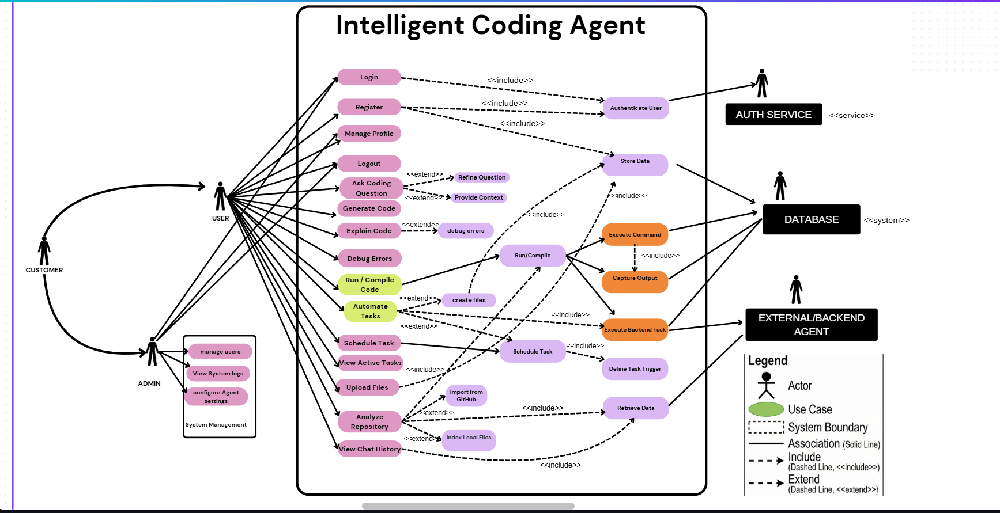

Step 1: Identify the use cases that need to be represented 

1.0 Account & Profile Management
1.1 Login
1.2 Register 
1.3 Manage Profile
1.4 Logout

2.0 Coding & AI Assistance
2.1 Ask Coding Question
2.2 Refine Question
2.3 Provide Context
2.4 Generate Code
2.5 Explain Code
2.6 Debug Errors

3.0 Code Execution & Files
3.1 Run / Compile Code
3.2 Create Files
3.3 Upload Files
3.4 Analyze Repository
3.5 Import from GitHub
3.6 Index Local Files

4.0 Task Automation
4.1 Automate Tasks
4.2 Schedule Tasks
4.3 Define Task Triggers
4.4 View Active Tasks
4.5 Execute Backend Tasks

5.0 System Management (Admin)
5.1 Manage Users
5.2 View System Logs
5.3 Configure Agent Settings

6.0 Backend & Data Operations
6.1 Authenticate User
6.2 Store Data
6.3 Retrieve Data
6.4 Execute Command
6.5 Capture Output

Step 2: List the actors (external users) that interact with the system 
(Total Marks: 10) 

1.0 Primary Actors (Initiate the interaction)
1.1 User (Developer / Student): The main person who asks questions, uploads files, and runs code.
1.2 Admin (System Management): The person responsible for managing users, logs, and agent configurations.

2.0 Secondary Actors (External systems that support the interaction)
2.1 Auth Service: External service used to validate user credentials.
2.2 Database: External system used to store and retrieve persistent data.
2.3 External Backend Agent: Separate service or agent that executes complex backend tasks.

Use Case Diagram 

https://www.canva.com/design/DAG-1Fzju_o/n1pzYmuTzrvcmuvWtsP4fQ/edit

