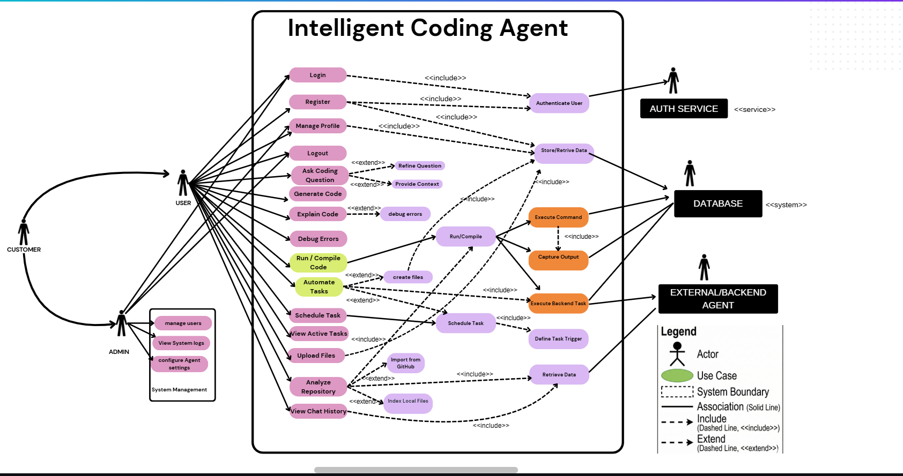

## Step 1 — Identify the use cases

### 1. Account & Profile Management
- **1.1** Login
- **1.2** Register
- **1.3** Manage Profile
- **1.4** Logout

### 2. Coding & AI Assistance
- **2.1** Ask Coding Question
- **2.2** Refine Question
- **2.3** Provide Context
- **2.4** Generate Code
- **2.5** Explain Code
- **2.6** Debug Errors

### 3. Code Execution & Files
- **3.1** Run / Compile Code
- **3.2** Create Files
- **3.3** Upload Files
- **3.4** Analyze Repository
- **3.5** Import from GitHub
- **3.6** Index Local Files

### 4. Task Automation
- **4.1** Automate Tasks
- **4.2** Schedule Tasks
- **4.3** Define Task Triggers
- **4.4** View Active Tasks
- **4.5** Execute Backend Tasks

### 5. System Management (Admin)
- **5.1** Manage Users
- **5.2** View System Logs
- **5.3** Configure Agent Settings

### 6. Backend & Data Operations
- **6.1** Authenticate User
- **6.2** Store Data
- **6.3** Retrieve Data
- **6.4** Execute Command
- **6.5** Capture Output

## Step 2 — Actors

### Primary Actors (initiate interaction)
- **User (Developer / Student):** Asks questions, uploads files, runs code.
- **Admin (System Management):** Manages users, logs, and agent configurations.

### Secondary Actors (external systems)
- **Auth Service:** Validates user credentials.
- **Database:** Stores and retrieves persistent data.
- **External Backend Agent:** Executes complex backend tasks.

## Use Case Diagram

Design (Canva): https://www.canva.com/design/DAG-1Fzju_o/n1pzYmuTzrvcmuvWtsP4fQ/edit

---

## Intelligent Coding Agent – UML Relationships

### Actors
- **Customer**
  - Generalizes into **User**
  - Interacts indirectly with the system

- **User**
  - Primary actor
  - Initiates all functional use cases (coding, execution, tasks, files)

- **Admin**
  - Specialized actor
  - Accesses only **System Management** functions

---

### System Boundary
- **Intelligent Coding Agent**
  - Encloses all internal use cases
  - External systems interact only via defined use cases

---

### Associations (Solid Lines)
- **User → Use Cases**
  - Login, Register, Manage Profile, Logout
  - Ask Coding Question, Generate Code, Explain Code, Debug Errors
  - Run/Compile Code, Automate Tasks, Schedule Task
  - View Active Tasks, Upload Files
  - Analyze Repository, View Chat History

- **Admin → System Management**
  - Manage users
  - View system logs
  - Configure agent settings

---

### `<<include>>` Relationships (Mandatory)
- Login, Register, Manage Profile → **Authenticate User**
- Manage Profile → **Store/Retrieve Data**
- View Chat History → **Retrieve Data**
- Analyze Repository → **Retrieve Data**
- Run/Compile Code → **Execute Command**
- Execute Command → **Capture Output**
- Automate Tasks → **Execute Backend Task**
- Schedule Task → **Define Task Trigger**

---

### `<<extend>>` Relationships (Optional)
- Ask Coding Question → **Refine Question**
- Ask Coding Question → **Provide Context**
- Generate Code → **Explain Code**
- Explain Code → **Debug Errors**
- Run/Compile Code → **Create Files**
- Analyze Repository → **Import from GitHub**
- Analyze Repository → **Index Local Files**

---

### External Systems
- **Auth Service (`<<service>>`)**
  - Used by **Authenticate User**

- **Database (`<<system>>`)**
  - Used by Store/Retrieve Data, Retrieve Data, Capture Output

- **External / Backend Agent**
  - Used by Execute Command, Execute Backend Task

