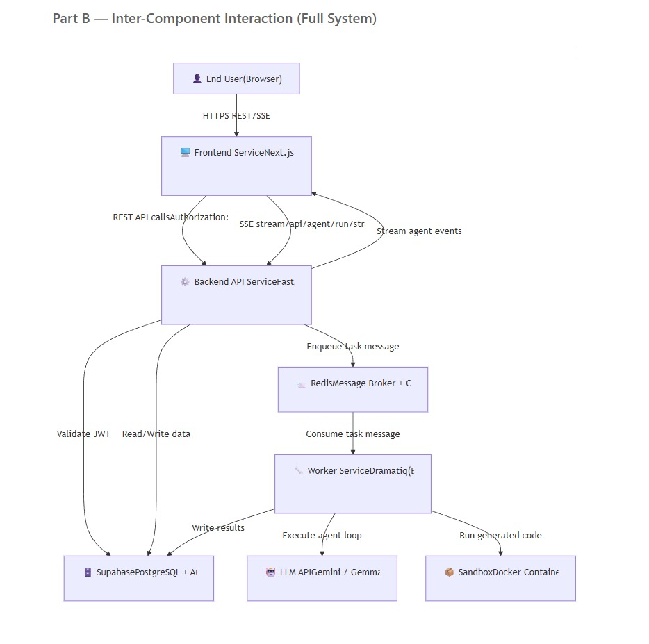

# Assignment 5 — BeatCode: Deployment, Access & Implementation
**Project:** BeatCode — AI-Powered Coding Agent (Microservices Architecture)

---

## I. How Are You Planning to Host These Application Components?

### Host Site (Target Deployment Platform)

| Component | Host / Cloud Service | Rationale |
|---|---|---|
| **Frontend** (Next.js) | **Vercel** | Native Next.js support, global CDN, zero-config deployments |
| **Backend API** (FastAPI) | **Railway / AWS EC2** | Docker container support, persistent processes, WebSocket support |
| **Worker Service** (Dramatiq) | **Railway (separate service)** | Same Docker image as API, scaled independently |
| **Redis** (Message Broker) | **Railway Redis** or **Upstash Redis** | Managed Redis, low-latency, same network as API/Worker |
| **Supabase** (PostgreSQL) | **Supabase Cloud** (managed) | Hosted PostgreSQL + Auth + Storage, already integrated |
| **Sandbox** (Code Execution) | **Docker-in-Docker on EC2** | Requires Docker socket access (`/var/run/docker.sock`) |

---

### Deployment Strategy (Steps)

#### Step 1 — Containerize Services
- Each service has its own `Dockerfile` in `backend/` and `frontend/`.
- `docker-compose.yaml` defines the full stack locally; production uses individual container deployments.

#### Step 2 — Deploy Supabase (Database)
- Use **Supabase Cloud** (managed).
- Run SQL migrations from `backend/supabase/migrations/` via the Supabase dashboard or CLI:
  ```bash
  supabase db push
  ```
- Copy the `SUPABASE_URL` and `SUPABASE_SERVICE_ROLE_KEY` to environment variables.

#### Step 3 — Deploy Redis
- Provision a **Railway Redis** instance or **Upstash** (serverless Redis).
- Note the `REDIS_URL` (e.g., `redis://default:<password>@host:6379`).

#### Step 4 — Deploy Backend API (FastAPI)
- Push `backend/` Docker image to a container registry (Docker Hub / GitHub Container Registry).
- Deploy on **Railway** or **AWS EC2** with:
  ```bash
  docker run -d -p 8000:8000 \
    --env-file .env \
    -e REDIS_URL=redis://... \
    beatcode-api:latest
  ```
- Server config: 2 vCPU, 4 GB RAM minimum; Uvicorn with 4 workers.
- Health check endpoint: `GET /api/health`.

#### Step 5 — Deploy Worker Service (Dramatiq)
- Deploy the **same Docker image** as the API but override the command:
  ```bash
  uv run dramatiq --processes 2 --threads 4 run_agent_background
  ```
- Worker connects to the **same Redis** instance as the API for job consumption.
- Scale horizontally by adding more worker replicas.

#### Step 6 — Deploy Frontend (Next.js on Vercel)
- Connect GitHub repo to **Vercel**.
- Set environment variable:
  ```
  NEXT_PUBLIC_API_URL=https://api.beatcode.app
  ```
- Vercel auto-builds on every push to `main`.

#### Step 7 — Configure API Communication
- Frontend → Backend: REST API calls to `https://api.beatcode.app/api/*`
- Backend API → Worker: Enqueues Dramatiq messages via **Redis** (no direct HTTP call).
- Backend API → Supabase: Via Supabase Python client using `SUPABASE_URL` + `SERVICE_ROLE_KEY`.
- CORS configured in `main.py` to allow `https://trybeatcode.com` and `https://www.trybeatcode.com`.

---

### Security Measures

- **HTTPS / TLS Encryption**: All traffic encrypted in transit via Vercel's and Railway's built-in TLS certificates.
- **CORS Policy**: Backend restricts allowed origins to the production frontend domain only (configured in `main.py`).
- **JWT Authentication**: Supabase Auth issues JWTs; every API request validates the token via `Authorization: Bearer <token>` header.
- **Environment Variables**: All secrets (`SUPABASE_SERVICE_ROLE_KEY`, `REDIS_URL`, `ANTHROPIC_API_KEY`, etc.) stored as encrypted environment variables — never committed to Git.
- **Sandbox Isolation**: Code execution runs inside ephemeral Docker containers, preventing access to the host system.
- **Redis Access Control**: Redis is bound to the internal private network only (`127.0.0.1:6380` locally; private VPC in production) — not exposed to the public internet.
- **Rate Limiting**: API endpoints protected by billing/usage checks in `services/billing.py`.

---

## II. (A) How can your end users access these services?


## II. (B) Draw a pictorial representation showing the interaction between the user and the system (front end), and the interaction between different components, including the backend.


---
