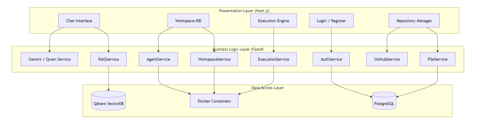
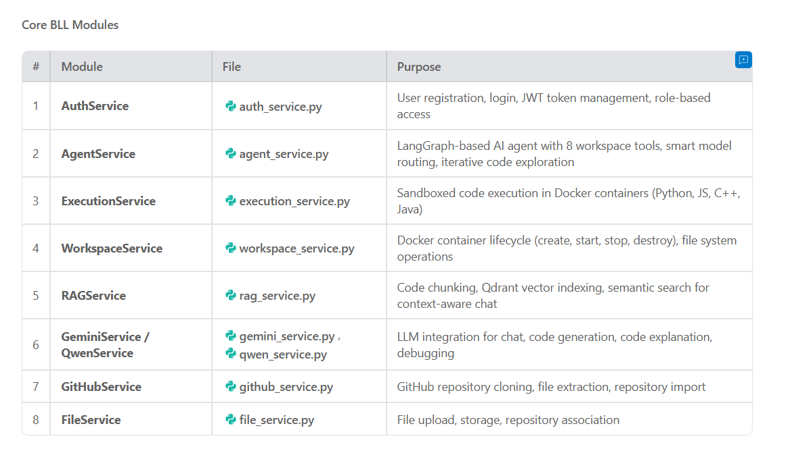

# CS 331 — Software Engineering Lab
## Assignment 7: Business Logic Layer (BLL)
**Project:** ICA — Intelligent Coding Agent  
**Team:** Abhas Sen

---

## Q1. Core BLL Modules and Presentation Layer Interaction [10 Marks]

### Architecture Overview

ICA follows a **3-tier architecture**: Presentation Layer (Next.js frontend) → Business Logic Layer (FastAPI services) → Data Access Layer (PostgreSQL + Qdrant + Docker).



### Core BLL Modules



### BLL ↔ Presentation Layer Interaction

#### 1. Authentication Flow
```
[Login Page] → POST /api/v1/auth/login → AuthService.authenticate_user()
                                          ├─ Validates email + password
                                          ├─ Checks user is_active
                                          └─ Returns JWT access + refresh tokens
[Frontend] stores token in localStorage → All subsequent API calls include Authorization: Bearer <token>
[deps.py] get_current_user() → Decodes JWT, validates type, checks user exists & is_active
```

#### 2. Workspace Agent Flow
```
[WorkspaceChat.tsx] → POST /api/v1/agent/act { workspace_id, prompt, provider }
                      → AgentService.plan_actions()
                        ├─ Creates 8 workspace tools bound to the container
                        ├─ Routes to correct LLM (Gemini/Qwen/HuggingFace)
                        ├─ Runs LangGraph agent loop (up to 20 iterations)
                        ├─ Agent calls tools: list_files, read_file, search_code, etc.
                        ├─ Nudges agent if it tries to conclude without exploring
                        └─ Returns AgentResponse { explanation, actions[], model_used }
[WorkspaceChat.tsx] → Displays explanation + proposed actions (file edits, commands)
                   → User accepts/rejects each action
                   → POST /api/v1/agent/apply { workspace_id, accepted_actions }
                      → AgentService.apply_actions() → Applies changes to container
```

#### 3. Code Execution Flow
```
[Execution Page] → POST /api/v1/execute/run { code, language, stdin, timeout }
                   → ExecutionService.execute_code()
                     ├─ Validates language (python/javascript/cpp/java)
                     ├─ Creates temp file, starts Docker container
                     ├─ Runs code with security constraints (no network, memory limit, CPU quota)
                     ├─ Captures stdout/stderr, exit_code, execution_time
                     └─ Returns ExecuteResponse { id, status, stdout, stderr, execution_time_ms }
[Frontend] → Displays output with syntax highlighting
          → POST /api/v1/execute/{id}/diagnose → AI analyzes errors and suggests fixes
```

#### 4. RAG-Enhanced Chat Flow
```
[ChatInterface.tsx] → User selects a repository from dropdown
                    → POST /api/v1/chat/message { message, repository_id, provider }
                      → RAGService.search_similar()
                        ├─ Embeds user query using Gemini embeddings
                        ├─ Searches Qdrant vector DB for relevant code chunks
                        └─ Returns top-k code snippets with file paths
                      → GeminiService/QwenService.generate_response(message, context=rag_results)
                        └─ LLM responds with repository-aware answer
```

---


## Q2C. Data Transformation [10 Marks]

Data undergoes multiple transformations as it flows between the Data Access Layer, BLL, and Presentation Layer.

### 1. Database → BLL: ORM → Pydantic Serialization

SQLAlchemy ORM models are transformed into Pydantic response schemas using `from_attributes = True`:

```python
# Data Layer (SQLAlchemy Model)
class Workspace(Base):
    __tablename__ = "workspaces"
    id = Column(Integer, primary_key=True)
    user_id = Column(Integer, ForeignKey("users.id"))
    status = Column(String, default="creating")
    container_id = Column(String, nullable=True)  # Internal — NOT exposed to frontend
    volume_name = Column(String, nullable=True)    # Internal — NOT exposed

# BLL → Presentation (Pydantic Schema)
class WorkspaceResponse(BaseModel):
    id: int
    name: str
    status: str           # Exposed
    repo_url: Optional[str]
    base_image: str
    created_at: datetime
    # container_id and volume_name are NOT in this schema — filtered out
    class Config:
        from_attributes = True  # Enables ORM → Pydantic conversion
```

This ensures **sensitive internal data** (container IDs, volume names, password hashes) is never sent to the frontend.

### 2. Docker Container Output → Structured File Tree

Raw `ls -laF` output from the Docker container is parsed and transformed into structured JSON:

```python
# Raw output from container:
# drwxr-xr-x 5 root root 4096 Mar 25 server/
# -rw-r--r-- 1 root root 1234 Mar 25 README.md

# Transformed to structured FileNode objects:
entries.append({
    "name": name,          # "README.md"
    "path": entry_path,    # "README.md"
    "type": "file",        # "file" or "dir"
    "size": 1234,          # bytes (None for directories)
})
```

### 3. File Extension → Language Detection

File extensions are transformed to language identifiers for syntax highlighting:

```python
EXTENSION_LANGUAGES = {
    ".py": "python", ".js": "javascript", ".ts": "typescript",
    ".tsx": "typescript", ".jsx": "javascript", ...
}

# In read_file():
ext = "." + path.rsplit(".", 1)[-1].lower()
language = EXTENSION_LANGUAGES.get(ext)  # ".py" → "python"
# Returns: {"path": "main.py", "content": "...", "language": "python"}
```

The frontend uses this [language](./beatcode/backend/app/services/execution_service.py#57-60) field to configure Monaco editor syntax highlighting.

### 4. LLM Response → Structured Agent Actions

Raw AI model output (tool calls + text) is transformed into structured [AgentResponse](./beatcode/frontend/src/lib/api.ts#352-358):

```python
# LangGraph produces: [SystemMessage, HumanMessage, AIMessage(tool_calls), ToolMessage, AIMessage(text)]

# Transformed by _build_response() to:
AgentResponse(
    explanation="I found the file and here's what I recommend...",  # Final text
    actions=[
        AgentAction(type="file_edit", path="server/auth.js", content="..."),
        AgentAction(type="run_command", command="npm install cookie-parser"),
    ],
    model_used="gemini",
    context_tokens_approx=150,
)
```

### 5. Execution Results → Frontend-Ready Response

Docker execution output is transformed from raw container data to structured response:

```python
# Raw from Docker:
# stdout bytes, stderr bytes, exit_code integer, container timing

# Transformed to:
ExecuteResponse(
    id=42,
    language="python",
    status="success",        # Computed: exit_code == 0 ? "success" : "error"
    stdout="Hello World\n",  # Decoded UTF-8, capped at 50KB
    stderr="",
    exit_code=0,
    execution_time_ms=150,   # Computed from wall clock timing
    created_at=datetime(...)
)
```

### 6. RAG: Code Files → Vector Embeddings → Context Snippets

```
[GitHub Repo] → GitHubService extracts files
              → RAGService chunks code (by functions/classes)
              → Gemini Embeddings → 768-dim vectors
              → Stored in Qdrant vector database

[User Query] → Embedded into vector
             → Qdrant cosine similarity search
             → Top-k chunks returned as formatted context:
               "File: server/auth.js (Lines 10-35)\n```js\n...\n```"
             → Injected into LLM prompt as context
```

### Data Transformation Summary

| From | To | Transformation |
|------|----|---------------|
| SQLAlchemy ORM object | Pydantic JSON response | `from_attributes=True`, field filtering |
| Docker `ls -laF` output | `FileNode[]` JSON | Line parsing, type detection |
| File extension ([.py](./beatcode/copy_files.py)) | Language string (`python`) | Dictionary lookup |
| LangGraph message history | [AgentResponse](./beatcode/frontend/src/lib/api.ts#352-358) JSON | Message extraction, tool call grouping |
| Docker container output | [ExecuteResponse](./beatcode/backend/app/schemas/execution.py#15-29) JSON | UTF-8 decode, status computation, timing |
| Code files | Vector embeddings | Chunking → Gemini embedding → Qdrant storage |
| Qdrant search results | LLM context string | Formatted code snippets with file paths |

---
